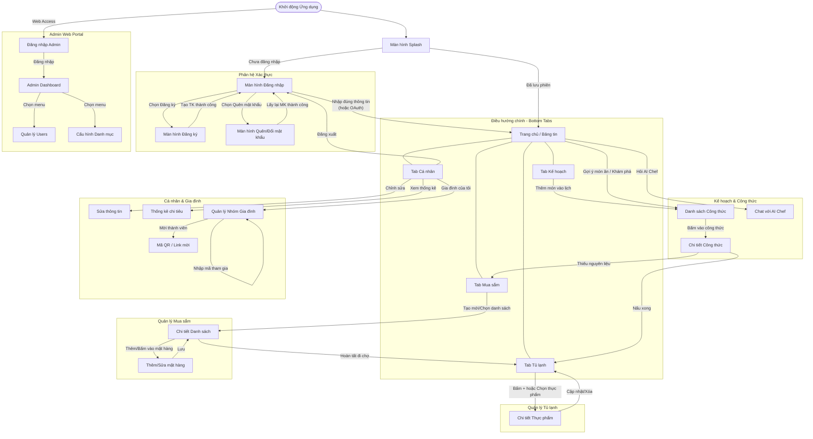

# Sơ đồ chuyển màn hình (Screen Flow / User Flow)

Sơ đồ dưới đây thể hiện luồng di chuyển giữa các màn hình trong ứng dụng NaviMart (Hệ thống đi chợ tiện lợi). Các mũi tên có dán nhãn (label) để giải thích thao tác hoặc điều kiện kích hoạt việc chuyển màn hình.

### Chú thích các luồng quan trọng:
1. **Luồng Hoàn tất đi chợ (Finish Shopping):** Khi người dùng mua xong, hàng hóa từ `Chi tiết Danh sách` sẽ được kích hoạt chạy thẳng vào hệ thống `Tab Tủ lạnh` và tự động tăng số lượng.
2. **Luồng Nấu ăn (Cook):** Khi đánh dấu "Nấu xong" từ một `Chi tiết Công thức`, hệ thống sẽ tự động trừ nguyên liệu tương ứng trong `Tab Tủ lạnh`.
3. **Luồng Bổ sung nguyên liệu:** Nếu xem `Chi tiết Công thức` mà hệ thống phát hiện Tủ lạnh không đủ đồ, sẽ có luồng điều hướng thẳng sang `Tab Mua sắm` để thêm các món còn thiếu vào danh sách đi chợ.
4. **Luồng Gia đình:** Các thành viên trong cùng một gia đình (khi dùng chung mã từ `Quản lý Nhóm Gia đình`) sẽ dùng chung trạng thái của cả 4 tab: Tủ lạnh, Mua sắm, Kế hoạch và Công thức.
